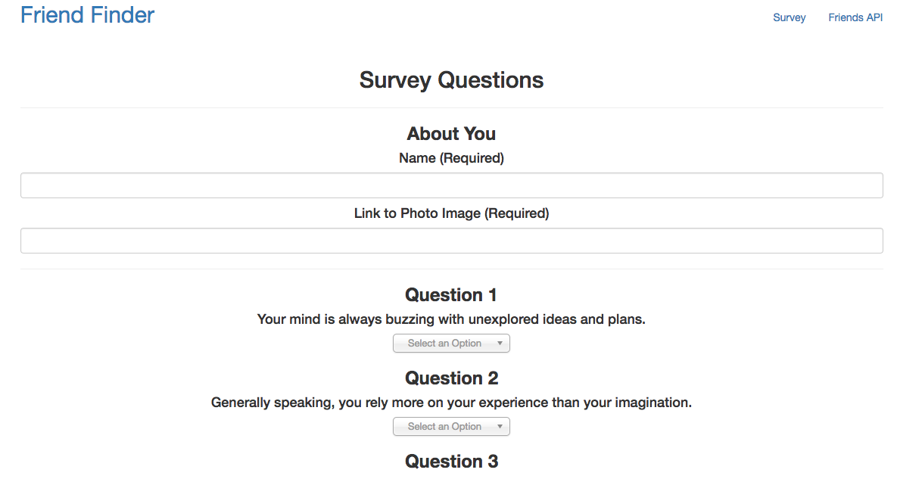
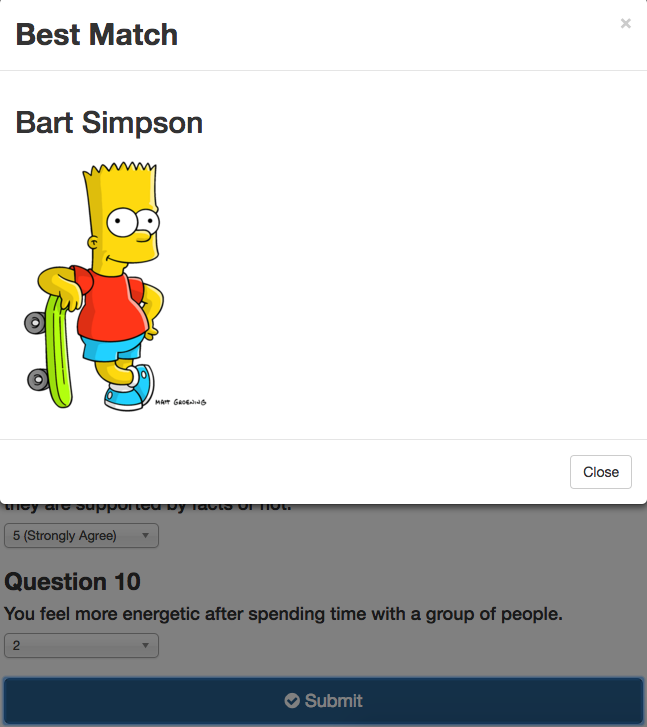

# FriendFinder

Link to deployed Heroku App: https://secure-woodland-69342.herokuapp.com/

### Description
***

This repository is a mock friend finding app. The user takes a survey of 10 questions. When the survey is submitted the data is compared to that of a collection of preexisting users. The user is then matched with the user that they are most alike.

#### Contributors:
***

Casey Rubel [GitHub](https://github.com/caseyrubel)

#### Technologies Used:
***

* Javascript
* nodeJS